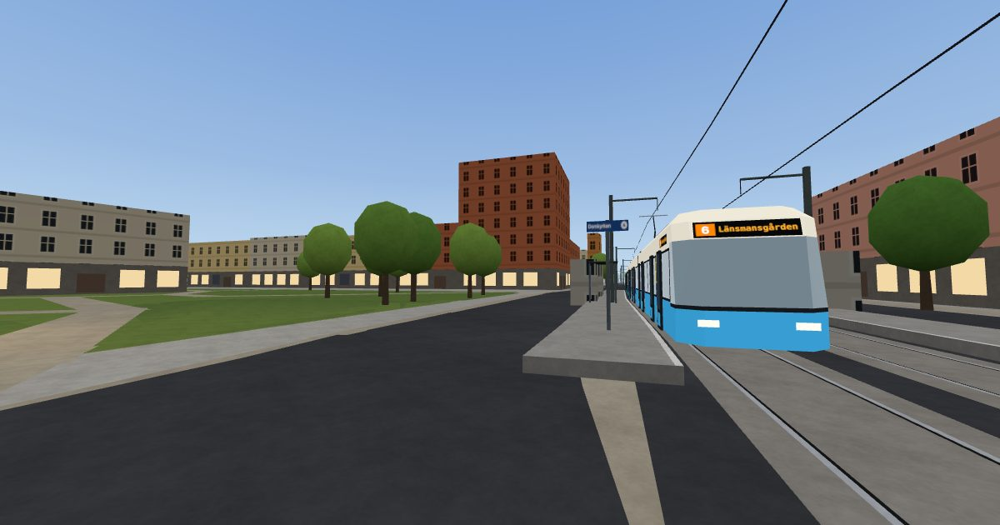

# Över Göteborg

**Gothenburg's inner city in your browser: walk its streets and ride its trams, on the real timetable.**



Walk the heart of Gothenburg at street level, from Centralen and Drottningtorget past Brunnsparken, Kungsportsplatsen and the cathedral to Grönsakstorget, Stenpiren and Järntorget. Every tram line through the area runs on Västtrafik's timetable, in the city's 45 m M34 cars: step aboard at a stop, ride it round the curves while it calls the next stop, and read the departure boards on the platforms. Game time is Unix time, so every visitor meets the same trams, and no two ever run into each other: the timetable is cleared of conflicts offline, second by second.

Över Göteborg is a fork of Joel Hägvall's [Under Stockholm](https://github.com/joelhagvall/under-stockholm), the whole Stockholm metro in the browser, and keeps its method: live data reaches the game only through a relay of its own, and a quality gate that the coding agent cannot get past keeps the build fast and whole. The plan, its phases and what is done is in [PLAN.md](docs/PLAN.md).

TypeScript, three.js and Rapier, no game engine. Made by [Fredrik Carlsson](https://www.linkedin.com/in/fredrik-carlsson-0b829a40), on the shoulders of Under Stockholm by [Joel Hägvall](https://joelhagvall.com/).

## Play

```bash
bun install
bun run dev
```

Open http://localhost:5180. Walk with WASD and the mouse, run with Shift, jump with Space; V turns the trams' sway off and on, M the sound, P pixel mode.

## Development

| Script | What it does |
| --- | --- |
| `bun run dev` | Dev server with hot reload, plus the relay; both pick free ports |
| `bun run build` | Type-check and build to `dist/` |
| `bun run typecheck` | Type-check only |
| `bun run serve:prod` | Serve `dist/` with gzip on port 4173 (use this for audits) |
| `bun test` | Unit tests (the timetable, the trams never overlapping, the tracks, the city's squares, i18n and more) |
| `bun run check` | The quality gate: types, tests, build budgets, leaks, frame rates, time to playing, Lighthouse and pa11y, against floors and the committed baseline, in levels (`--quick`, `--smoke`, `--perf`, `--web`, plus `--device` and `--accept`). `git push` runs the quick and smoke levels |
| `bun run release` | All of the gate, on its own |
| `bun run deploy` | The only way to go live, to the address in `SITE_URL`: a clean, pushed tree, the whole gate, then the production build and the upload (`--dry-run` stops before it). `--landing` puts out the landing page alone, without the game |
| `bun run mem` | Leak check in headless Chrome: walk across the city and back, fail if anything is left behind (needs `bun run dev`) |
| `bun run fps` | Real frame rates in headless Chrome on this machine's GPU, as a desktop and as a phone: the squares, the trams at Drottningtorget and a run through the city; `--device` adds an Android phone over USB (needs `bun run dev`) |
| `bun run load` | Time from click to playing, desktop and slow 4G phone (needs `bun run serve:prod`) |
| `bun scripts/gbg-osm.ts` | The city's squares and the track graph from OpenStreetMap |
| `bun scripts/gbg-gtfs.ts` | The trams' timetable from Västtrafik's GTFS feed, matched to the tracks and cleared of conflicts |

The build fails if the landing page or the game grows past its compressed budget, and `bun run check` fails if it got slower than the numbers in `perf/baseline.json`. After launch, the relay's `/perf` page shows how the game runs for players: one anonymous report per visit (frame times, resolution, loading, class of device; no identifiers), and `/errors` what went wrong in their games.

`?debug` never pauses and exposes `window.__us`: `__us.go('Brunnsparken')` stands on a square with the city built round it, `__us.ride()` puts you aboard the nearest tram at a stop. `clock=HH:MM` and `weather=rain` set the time and the weather. More in [AGENTS.md](AGENTS.md).

## Data and credits

Live data reaches the game only through the relay (a Cloudflare Worker in production, [DRIFT.md](docs/DRIFT.md)), which asks each source once per interval for every player. Browsers never call them.

| Source | Used for | Licence |
| --- | --- | --- |
| [OpenStreetMap](https://www.openstreetmap.org/copyright), © OpenStreetMap contributors | The city's buildings, streets, parks and water, the tram tracks, Kopparmärra's place | [ODbL](https://opendatacommons.org/licenses/odbl/) |
| [Trafiklab GTFS Regional](https://www.trafiklab.se/api/gtfs-datasets/gtfs-regional/), Västtrafik | The trams' timetable | CC0 1.0 |
| [Wikidata](https://www.wikidata.org/) | The tram lines' colours on the signs | CC0 1.0 |
| [Open-Meteo](https://open-meteo.com/) | The weather in the city | [CC BY 4.0](https://creativecommons.org/licenses/by/4.0/) |
| [SMHI](https://www.smhi.se/) | Weather warnings for Västra Götaland County | SMHI's open data terms, source named in the game |

The city's data lives in `src/game/city/osm/`: the squares (`tiles/`), the track graph (`tracks.json`) and the timetable (`schedule.json`, and the game's packed copy in `trams/`). Built with [three.js](https://threejs.org) (MIT) and [Rapier](https://rapier.rs) (Apache 2.0). Everything heard in the city (the trams, the bell, rain, gulls, the cathedral's bell) is made at runtime; no sound files.

The Stockholm metro's code and data are still in the repository until they are removed ([PLAN.md](docs/PLAN.md), P7), out of the build: SL's open data through Trafiklab, Sveriges Radio's API, the Copernicus DEM GLO-30, Albert Guillaumes' [station plans](http://stations.albertguillaumes.cat/) (reference only) and public domain and CC0 sounds ([sources](public/audio/sfx/README.md)).

## Disclaimer

A fan project. Not affiliated with or endorsed by Västtrafik, Göteborgs Spårvägar, Göteborgs Stad, SL, Region Stockholm, Sveriges Radio or SMHI, nor by Joel Hägvall.

## License

The code is MIT ([LICENSE](LICENSE)), Under Stockholm's by Joel Hägvall and the changes by Fredrik Carlsson. It covers the projects' own work, not Västtrafik's, SL's or Region Stockholm's names and marks, nor the data above, which keeps its own licence. The recorded C20 announcements are not part of the repository ([why](public/audio/README.md)).
